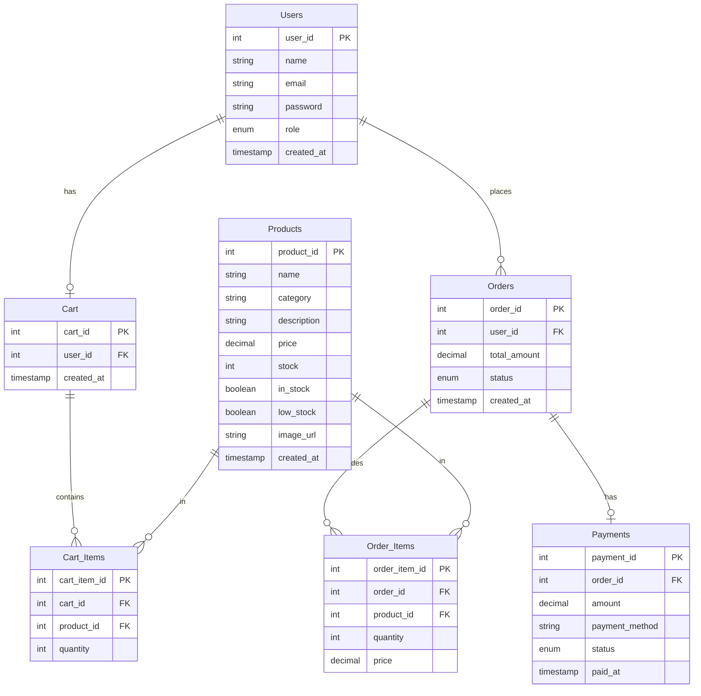

# DBS Lab Final Project: Protein Store

A database-driven protein store management system built as a final project for my Database Systems lab.

## Features

* **Product Catalog & Management**: Full CRUD operations for supplements with pagination, stock control, and image upload.
* **AI-Powered Product Descriptions**: Auto-generates engaging, SEO-friendly descriptions using Gemini 2.5 Flash.
* **Smart Search Parser**: Translates natural language shopping queries (e.g., "chocolate pre-workout under ₹2000") into structured database filter parameters.
* **Personalized Diet & Macro Advisor**: Computes user BMR/TDEE and recommends matching protein/supplement packages directly from active inventory.
* **Customer Support Chatbot**: Real-time help for supplemental FAQs and order tracking integration.
* **Secure AI SQL Analytics Console**: Translates natural language questions to read-only MySQL SELECT queries with application-level and db-level permission guardrails.
* **Order & Payments System**: Complete checkout flow, cart management, and payment validation.
* **Admin Dashboard**: Live sales charts, inventory status, and database insight panel.

## Tech Stack

* **Frontend**: React (React Router, Axios, CSS Modules)
* **Backend**: Node.js & Express (RESTful APIs)
* **Database**: MySQL (with views, pools, and custom triggers)
* **AI Engine**: Google Gemini API (`gemini-2.5-flash` via `@google/generative-ai`)
* **Security & Guardrails**: JWT authentication, custom SQL sanitizer/limiter, role-based database permissions

## User View Screenshots
<table>
  <tr>
    <td></td>
    <td></td>
  </tr>
  <tr>
    <td></td>
    <td></td>
  </tr>
  <tr>
    <td></td>
    <td></td>
  </tr>
</table>


## Admin View Screenshots
<table>
  <tr>
    <td></td>
    <td></td>
    <td></td>
  </tr>
  <tr>
    <td></td>
    <td></td>
    <td></td>
  </tr>
  <tr>
    <td></td>
    <td></td>
    <td></td>
  </tr>
  <tr>
    <td></td>
    <td></td>
    <td></td>
  </tr>
</table>

## Database Entity-Relationship (ER) Diagram



---

## How to Run

### 1. Local Setup
1. **Clone the repository.**
2. **Setup the Database:**
   * Import the MySQL schema:
     ```bash
     mysql -u root -p < schema.sql
     ```
   * To enable the **AI Analytics Console (Phase 2c)** securely, connect to MySQL as root and execute the read-only grants:
     ```sql
     CREATE USER 'reporter_user'@'localhost' IDENTIFIED BY '<use-a-strong-custom-password-here>';
     GRANT SELECT ON protein_store.Products TO 'reporter_user'@'localhost';
     GRANT SELECT ON protein_store.Orders TO 'reporter_user'@'localhost';
     GRANT SELECT ON protein_store.Order_Items TO 'reporter_user'@'localhost';
     GRANT SELECT ON protein_store.Payments TO 'reporter_user'@'localhost';
     GRANT SELECT ON protein_store.vw_product_stock_status TO 'reporter_user'@'localhost';
     GRANT SELECT ON protein_store.vw_order_summary TO 'reporter_user'@'localhost';
     FLUSH PRIVILEGES;
     ```
3. **Configure Environment Variables:**
   * Create or update `backend/.env` file with these keys:
     ```ini
     PORT=5000
     DB_HOST=localhost
     DB_USER=root
     DB_PASSWORD=your_mysql_root_password
     DB_NAME=protein_store
     JWT_SECRET=supersecretjwtkey123!
     
     # AI Integrations (Get a free key from Google AI Studio)
     GEMINI_API_KEY=your_gemini_api_key_here
     
     # Secure read-only reporter user (Phase 2c)
     REPORTER_DB_USER=reporter_user
     REPORTER_DB_PASSWORD=your_reporter_password_here
     ```
4. **Run Backend Server:**
   ```bash
   cd backend
   npm install
   npm run dev
   ```
5. **Run Frontend Development Server:**
   ```bash
   cd frontend
   npm install
   npm start
   ```
   Open [http://localhost:3000](http://localhost:3000) in your browser.

---

### 2. Run with Docker
If you have Docker and Docker Compose installed, run the entire stack (Database, Backend API, React Frontend) in one command:
```bash
# Provide your Gemini key in the environment or .env
docker-compose up --build
```
The database will automatically initialize itself with the sample products and schema.

---

## Running Integration Tests
To run HTTP-level backend integration tests verifying standard endpoints:
```bash
cd backend
npm run test
```

## Authors

* Rijul Yadav
* Nitya Mehrotra
* Divit Khandelwal
