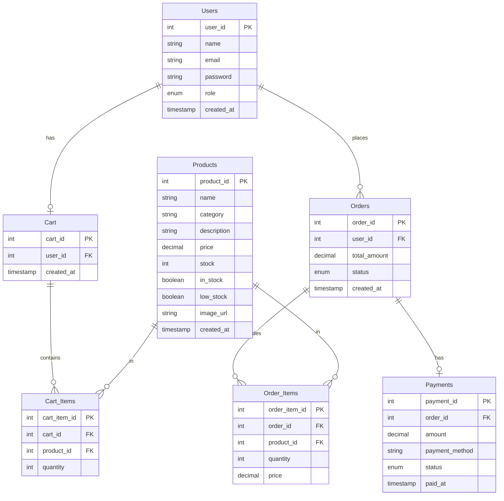

# DBS Lab Final Project: Protein Store

A database-driven protein store management system built as a final project for my Database Systems lab.

## Features

* Product listing
* Order management
* Admin dashboard
* Order history
* Sales statistics

## Tech Stack

* MySQL
* Node.js / Express (if applicable)
* HTML/CSS/JS

## User View Screenshots
<table>
  <tr>
    <td></td>
    <td></td>
  </tr>
  <tr>
    <td></td>
    <td></td>
  </tr>
  
</table>


## Admin View Screenshots
<table>
  <tr>
    <td></td>
    <td></td>
  </tr>
  <tr>
    <td></td>
    <td></td>
/>

    
  </tr>
  
</table>

## Database Entity-Relationship (ER) Diagram



---

## How to Run

### 1. Local Setup
1. **Clone the repository.**
2. **Setup the Database:**
   * Import the MySQL schema:
     ```bash
     mysql -u root -p < schema.sql
     ```
   * To enable the **AI Analytics Console (Phase 2c)** securely, connect to MySQL as root and execute the read-only grants:
     ```sql
     CREATE USER 'reporter_user'@'localhost' IDENTIFIED BY '<use-a-strong-custom-password-here>';
     GRANT SELECT ON protein_store.Products TO 'reporter_user'@'localhost';
     GRANT SELECT ON protein_store.Orders TO 'reporter_user'@'localhost';
     GRANT SELECT ON protein_store.Order_Items TO 'reporter_user'@'localhost';
     GRANT SELECT ON protein_store.Payments TO 'reporter_user'@'localhost';
     GRANT SELECT ON protein_store.vw_product_stock_status TO 'reporter_user'@'localhost';
     GRANT SELECT ON protein_store.vw_order_summary TO 'reporter_user'@'localhost';
     FLUSH PRIVILEGES;
     ```
3. **Configure Environment Variables:**
   * Create or update `backend/.env` file with these keys:
     ```ini
     PORT=5000
     DB_HOST=localhost
     DB_USER=root
     DB_PASSWORD=your_mysql_root_password
     DB_NAME=protein_store
     JWT_SECRET=supersecretjwtkey123!
     
     # AI Integrations (Get a free key from Google AI Studio)
     GEMINI_API_KEY=your_gemini_api_key_here
     
     # Secure read-only reporter user (Phase 2c)
     REPORTER_DB_USER=reporter_user
     REPORTER_DB_PASSWORD=your_reporter_password_here
     ```
4. **Run Backend Server:**
   ```bash
   cd backend
   npm install
   npm run dev
   ```
5. **Run Frontend Development Server:**
   ```bash
   cd frontend
   npm install
   npm start
   ```
   Open [http://localhost:3000](http://localhost:3000) in your browser.

---

### 2. Run with Docker
If you have Docker and Docker Compose installed, run the entire stack (Database, Backend API, React Frontend) in one command:
```bash
# Provide your Gemini key in the environment or .env
docker-compose up --build
```
The database will automatically initialize itself with the sample products and schema.

---

## Running Integration Tests
To run HTTP-level backend integration tests verifying standard endpoints:
```bash
cd backend
npm run test
```

## Authors

* Rijul Yadav
* Nitya Mehrotra
* Divit Khandelwal

